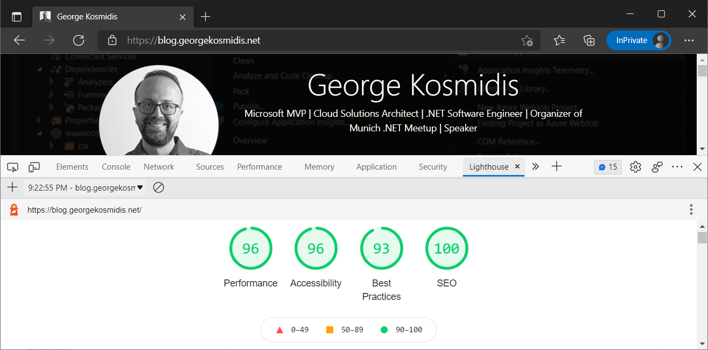

# A static blog builder for developers, written in .NET 6 and all C# 10 goodies!

[](https://portal.azure.com/#create/Microsoft.Template/uri/https%3A%2F%2Fraw.githubusercontent.com%2Fgeorgekosmidis%2Fblog.net%2Fmain%2FAzureDeploy.json) 

[](https://github.com/georgekosmidis/blog.net/actions/workflows/prepare-static-app.yml) [](https://github.com/georgekosmidis/blog.net/actions/workflows/push-static-app.yml)

It started as my ```nullable reference types``` playground because this option is now enabled by default (C# 10 project templates), but it evolved as a command-line **static blog builder** project! So yes, a clone of this repo is used to automatically build my very own blog that you can find at https://blog.georgekosmidis.net :)

Feel free to fork the solution and create your own! Contact [me](https://georgekosmidis.net) for any questions or additional support, like deploying for free as an Azure Static Web App (_I am faster if you use [twitter](https://twitter.com/intent/tweet?text=I%20have%20a%20question%20about%20your%20blog%20builder,%20George&url=https://github.com/georgekosmidis/blog.georgekosmidis.net&via=georgekosmidis) :)_ )

> The solution follows fail-fast and throws an ```Exception``` when something is not as it should. This is by design because I wouldn't want to go forward and automatically publish my blog unless the process completed smoothly and with no errors at all. If you find that an error is forgiven, please [let me know](https://georgekosmidis.net) and I will immediately throw an exception :) 

## Lighthouse report of the index page
[](https://raw.githubusercontent.com/georgekosmidis/blog.georgekosmidis.net/main/_readme/lighthouse.png)

## Table of Contens
* [Lighthouse report of the index page](#lighthouse-report-of-the-index-page)
* [Short description of features](#short-description-of-features)
* [There is no UI!](#there-is-no-ui-)
    * [The yml file](#the-yml-file)
    * [Folder Structure](#folder-structure)
* [Templating](#templating)
    * [Current template dependencies](#current-template-dependencies)
    * [Main templates:](#main-templates)
    * [Card templates](#card-templates)
* [Index Page](#index-page)
* [Writing a new article](#writing-a-new-article)
* [Adding a "standalone" page](#adding-a--standalone--page)
* [The "Just Copy Me" folder](#the--just-copy-me--folder)
* [Additional Cards](#additional-cards)
    * [Calendar Event Card](#calendar-event-card)
* [Commenting System](#commenting-system)
* [Migrating from WordPress](#migrating-from-wordpress)
* [That's it!](#that-s-it-)
* [And that is how my blog looks like!](#and-that-is-how-my-blog-looks-like) 

## Short description of features
1. Completely **free**, builds and deploys automatically with ```Azure DevOps``` to an ```Azure Static Web App```.
2. Fast and minified, loads in milliseconds (Check the [lighthouse report](https://raw.githubusercontent.com/georgekosmidis/blog.georgekosmidis.net/main/_readme/lighthouse.png)) 
3. Featuring a templating system based on ```Razor Engine``` and ```Bootstrap```.
5. Article and additional pages can be simple ```HTML``` with ```Bootstrap``` and ```highlightjs```.
6. There are different templates for every page group (e.g. article pages, index pages etc).
7. Index pages are using a ```masonry``` card (grid) system.
8. A card and an article page generated for each article.
9. There are additional card templates, like image cards and events cards.
10. There are can be additional pages like a privacy page.
11. SEO was in mind during building, with ```Open Graph``` tags and ```sitemap.xml``` build automatically in the root of the website. 

## There is no UI!
The builder is actually a ```Console App```, which you can use as a pipeline step in ```Azure DevOps``` and automate the build and publishing of your static website. If you want to build your site locally, either open the [_src/Blog.Builder.sln](_src/Blog.Builder.sln) solution and run it or just run the [/build.ps1](/build.ps1) powershell.

### The yml file
The [azure-pipelines.yml](/azure-pipelines.yml) contains the following steps:

1. ```task: UseDotNet@2``` - Use .NET 6
 Changes the version of .NET to .NET 6 for the subsequent tasks
1. ```task: DotNetCoreCLI@2``` - Build all solutions
 Builds all solutions to create fresh assemblies and to check that everything builds correctly
1. ```task: DotNetCoreCLI@2``` Publishing to ```$(tmpFolder)```
 Publishes the solution to the $(tmpFolder) defined as a variable at the beggining of the script
1. ```task: PowerShell@2``` - Running Builder
 Runs the builder with powershell by passing the two mandatory arguments: The location of the ```workables``` and the location of the ```_output```
1. ```task: AzureStaticWebApp@0``` - Pushing to Azure
 Does what it describes, pushes the contents of the ```_output``` folder to an ```Azure Static Web App.```
 
> The footer of the website contains a DateTime with the last build
 
### Folder Structure

- [_output](/_output)
 This is where the final HTML goes after the builder runs. The contents are picked up by a pipeline step and pushed to an (yours) ```Azure Static Web App.```
- [_readme](/_readme)
 Nothing special, just the mediaof this README
- [_src](/_src)
 Contains source code of the following solutions
   - [_src/Blog.Builder.sln](/_src/Blog.Builder.sln)
  This is the blog builder.
   - [_src/Wordpress.ContentMigrator.sln](/_src/Wordpress.ContentMigrator.sln)
  This is a helper solution I used to migrate my content from Wordpress. More on that in the [Migrating from WordPress](#migrating-from-wordpress) section.
- [workables](/workables)
 I don't even know if this is an existing word, but it means that in this folder you should find everything you want to for everyday(?) work with your blog.
   - [workables/articles](/workables/articles)
    Contains your precious blog posts. More on that in the [Writing a new article](#writing-a-new-article) section.
   - [workables/cards](/workables/cards)
    Contains all the additional cards of the blog, since each article already is also a card. More on that in the [Additional Cards](#additional-cards) section.
   - [workables/justcopyme](/workables/justcopyme)
    If you want anything copied unprocessed in the final HTML build, just put it here. More on that in the [The "Just Copy Me" folder](#the-just-copy-me-folder) section.
   - [workables/standalones](/workables/standalones)
    Contains standalone pages, like privacy.html. More on that in the [Adding a "standalone" page](#adding-a-standalone-page) section.
   - [workables/templates](/workables/templates)
    Contains all the available razor templates. More on that in the [Templating](#templating) section.
 
## Templating
Although templating should be the last thing to check because the default ones work great, there are some mandatory changes you should make in the [template-layout.cshtml](workables/templates/template-layout.cshtml) because it contains my social media links! In some future version these will be parameterized in the ```appsettings.json```, but for now just go in there and change them!

Besides these mandatory changes, you can use the rest of the templates as is or change them to meet your requirements:

### Current template dependencies
1. Bootstrap v5.1.3 - https://getbootstrap.com/
2. Masonry v4.2.2 - https://masonry.desandro.com/
3. highlightjs v11.4.0 - https://highlightjs.org/
4. cookieconsent v3.1.1 - https://www.osano.com/cookieconsent

### Main templates:
- [template-layout.cshtml](workables/templates/template-layout.cshtml), is the main layout template. All other templates are build and then used as a body for this template.
- [template-index.cshtml](workables/templates/template-index.cshtml), this is the body of the index templates. Not much going on here because of the masonry card system that leaves no space for other stuff. The cards are a combination of the article cards and other cards as described later on.
- [template-article.cshtml](workables/templates/template-article.cshtml), this is the body of an article page. In the right hand column there is a list of cards that have been selected as ```RightColumnPosition``` from their ```card.json```. Check [Additional Cards](#additional-cards) in this guide for more information.
- [template-standalone.cshtml](workables/templates/template-standalone.cshtml), this is the template of a standalone page, e.g. the privacy.html.
- [template-sitemap.cshtml](workables/templates/template-sitemap.cshtml), this is the template that builds the ```sitemap.xml```. 

### Card templates
- [template-card-article.cshtml](workables/templates/template-card-article.cshtml), this is the card for an article, which contains the title of the article, a description, the publishing date and optionally a featuring image.
- [template-card-calendar-events.cshtml](workables/templates/template-card-calendar-events.cshtml), this is the calendar events card, which can be used to automatically retrieve and display the next usegroup events or conferences that I (you) will participate. 
- [template-card-image.cshtml](workables/templates/template-card-image.cshtml), this is a simple image card with a link. For example, in my blog I use it to display my MVP award with a link towards mvp.microsoft.com.
- [template-card-search.cshtml](workables/templates/template-card-search.cshtml), this is a search engine for the site. Since it is a static website, this is using google. If you want to use this you should register with google and change the ```cx``` parameter.

## Index Page
The template that comes with this solution presents the articles as [Bootstrap Cards](https://getbootstrap.com/docs/5.1/components/card/) which are laid out using [Masonry](https://masonry.desandro.com/); you can find a guide for both of them in the [Bootstrap and Masonry](https://getbootstrap.com/docs/5.0/examples/masonry/) bootstrap page. Besides the articles card, additional cards can be added by following the guide that follows later in this page: [Additional Cards](#additional-cards).

Not all of the cards are displayed in the index page. The index page is paged into several depending on the property ```CardsPerPage``` that can be found in the [appsettings.json](_src/Blog.Builder/appsettings.json). Extra attention have to be paid for the *sticky* cards, cards that appear in every paged index page. Check the properties of the ```card.json``` from the [Additional Cards](#additional-cards) section. 

The name of the produced index is ```index.html``` and the rest are named following the pattern ```index-page-{PAGE_NUMBER}.html```. A paging is added at the end of each index page.

## Writing a new article
Everything is done from the file system using ```HTML```, ```Razor``` and ```JSON``` files, so you can use your favorite HTML editor! 
The process includes creating a folder in the [articles](workables/articles) folder and then creating a file named ```content.html``` to write the body of your article using ```HTML```, ```Razor```, ```highlightjs``` and ```Bootstrap``` styling. 

Once done you should then create a ```content.json``` file for the article metadata with the following properties:

| Property | Description |
| ----------- | ----------- |
| RelativeUrl | This is the relative url that will be created for this article, e.g. /csharp10.html. |
| Title | This is the title of the article. It will also be the title  of the page (```<title></title>```), the ```og.title``` meta tag and the tile of the card in the index page (check https://getbootstrap.com/docs/4.0/components/card/#titles-text-and-links).  |
| Description | This is the description of the article. It will also be the meta description (```<meta name="description" content="" />```), the ```og:description```, and the card in the index page. HTML is stripped for the meta tags. Check https://getbootstrap.com/docs/4.0/components/card/#titles-text-and-links. |,
| DatePublished | This is the published date of the article, in [ISO-8601](https://en.wikipedia.org/wiki/ISO_8601) format. |
| DateModified | This is the modified date of the article in [ISO-8601](https://en.wikipedia.org/wiki/ISO_8601) format. |
| RelativeImageUrl | This is the relative URL of the feature image, in the ```media``` folder, e.g. /media/unique-name-feature-image.png. |
| Tags | This is an arry of tags describing this article. They will be used in the ```og:article:tag```  meta tag. |

Although you can find many examples in the [articles](workables/articles) folder, here is one: 

```json
{
  "RelativeUrl": "/secrets-management-for-asp-net-core-and-azure-devops.html",
  "Title": "Secrets management for ASP.NET Core and Azure DevOps",
  "Description": "<p>In this post we will discover how to handle <em>appsettings.json</em> secrets (like API keys, passwords etc.) in a .NET app and eventually how to deploy a protected app and let <em>Azure DevOps</em> handle the secret replacement.</p>",
  "DatePublished": "2021-12-05T19:28:04+01:00",
  "DateModified": "2022-01-16T14:21:19+01:00",
  "RelativeImageUrl": "/media/100490-feature.png",
  "Tags": [
    "ASP.NET Core",
    "Azure DevOps",
    "Azure DevOps Variables",
    "Secrets",
    "user-secrets",
    "ASP.NET Core"
  ]
}
```
And at the end, if your new article contains media, create a folder named ```media``` and add everything in there. Paths in your article should be relative to that folder. Try to have unique names for the media files, but if you miss it no worries. No override is happening by default; if the builder finds a file with the same name it stops and throws an exception.

> It's a nice idea all paths to be relative!

> You can find many articles as examples here: workables/articles. *Numbering is not mandatory (like the 100490 in ```100490-secrets-management-for-asp-net-core-and-azure-devops```), but it makes my life easier in finding them in Windows Explorer*.

## Adding a "standalone" page
In case you want to add a static page like ```privacy.html``` it's fairly simple and very similar with the articles. Just visit the [standalones](workables/standalones) folder, add a new folder and in there add the ```content.html```, the ```content.json``` and optionally the ```media``` folder.  The [standalones](workables/standalones) folder already contains an example!

## The "Just Copy Me" folder
This a special folder that its contents will be copied directly to the output folder. Usefull for configs, additional media, etc. Check mine for an example: [justcopyme](workables/justcopyme).

## Additional Cards
The builder will automatically create a card for the UI for each article added, but it is a common need to add more than article cards.

To add a new card, create a new folder in the [cards](workables/cards) folder with whatever name you wish and add in there a ```card.json``` with the following information:

| Property | Description |
| ----------- | ----------- |
| TemplateDataModel | This is the model of the card and it can either be ```CardCalendarEventsModel```, ```CardImageModel``` or ```CardSearchModel``` |
| Title | The title of the card. Check https://getbootstrap.com/docs/4.0/components/card/#titles-text-and-links |
| Description | The description of the card. Check https://getbootstrap.com/docs/4.0/components/card/#body |
| Footer | Optionally, the footer of the card. Check https://getbootstrap.com/docs/4.0/components/card/#header-and-footer |
| Link | Optionally, the link where this card will lead. Check https://getbootstrap.com/docs/4.3/utilities/stretched-link/ |
| LinkTarget | Optionally, the link tarket. Check https://developer.mozilla.org/en-US/docs/Web/HTML/Element/a#attr-target |
| ImageUrl | Optionally, the the feature image of the card. Check https://getbootstrap.com/docs/4.0/components/card/#images |
| Position | The position within the masonry grid of the index pages. Article cards will be added automatically to "fill-in" the gaps of the additional cards. For example, if you wish to have 10 cards per page, and an additional image card to position index 0, the next 9 positions will be filled with article cards. |
| IsSticky | The position 0 of the previous hypothetical image card applies only to the first page of index. The next paged indexes (e.g. ```index-page-2.html```) will not have it unless this ```IsSticky``` is set to ```true```. So a bit simpler, if you want the image card to be in the position 0 of every paged index this should be ```true```. If set to ```false``` the hypothetical image card will only appear in ```index.html```. |
| RightColumnPosition | This card should also appear in the right column of the templates that support it. If you don't want to have this card anywhere else, add -1 here. |

And here is an example, although you can find more in the [cards](workables/cards) folder:
```json
{
  "TemplateDataModel": "CardImageModel",
  "Title": "Microsoft MVP - George Kosmidis",
  "Description": "Microsoft MVP - George Kosmidis",
  "Footer": "",
  "Link": "https://mvp.microsoft.com/en-us/PublicProfile/5004591",
  "LinkTarget": "_blank",
  "ImageUrl": "/media/mvp.png",
  "Position": 3,
  "IsSticky": true,
  "RightColumnPosition" : 1
}
```

### Calendar Event Card
This is a special card that code-wise depends on external services (specifically meetup.com), and also on events described as json files. The folder for this card is at [cards/events](workables/cards/events). A ```card.json``` describes the produced card the exact same way as in the additional cards above, but the additional events are described in folders within the [cards/events](workables/cards/events) folder. 

If you want to add an event, just add a folder in the [cards/events](workables/cards/events) folder and in there add an ```event.json``` with the following information:

| Property | Description |
| ----------- | ----------- |
| Organizer | The name of the entity that organizes this specific event. |
| OrganizerUrl | A URL for the organizer's webpage. |
| Title | The title of the event. |
| DateTime | The date or the datetime of the event in [ISO-8601](https://en.wikipedia.org/wiki/ISO_8601) format. |
| Place | A string for the place of the event. |
| Url | A URL for the event description. |

An example for an event.json file is the following:

```json
{
	"Organizer": "Munich .NET Meetup",
	"OrganizerUrl": "https://georgekosmidis.net",
	"Title" : "title",
    "DateTime" : "2022-01-18",
    "Place" : "Online",
    "Url" : "https://google.com"
}
```

## Commenting System
User commenting and interaction is super important but unfortunatelly I haven't found something I like yet. Since this is a static build, the only solution would be an online commenting system but it seems there is nothing good enough! In case you have a favorite one, feel free to change the templates and add it. 

Just as a sample, follows a list of online commenting systems that you can choose from (the order is random):

| Commenting System | Description |
| ----------- | ----------- |
| [Disqus](https://disqus.com/) | It's popular but not lightweight at all. | 
| [Hyvor Talk](https://talk.hyvor.com/) | Same as Disqus, packed with features but it's just too much. | 
| [Commento](https://commento.io/) | This one focuses a lot on privacy but it's kind of expensive. Nevertheles, a good candidate. | 
| [Staticman](https://averagelinuxuser.com/staticman-comments/) | Staticman is interesting as it is using Github for comments and builds a static HTML for comments, but it requires write access to my repo, which is not something I am willing to give. Good approach though, that sparks ideas. | 
| [ReplyBox](https://getreplybox.com/) | Again privacy oritented, simple commenting system but I couldn't find a way to backup my comments and the developer never answers! | 
| [GitTalk](https://gitalk.github.io/) | Gitalk is a modern comment component based on GitHub Issue and Preact. It's very interesting but unfortunatelly you have to have your Github API secret in public view, which is not cool at all. | 
| [Twitter](https://developer.twitter.com/en) | Having twitter for a commenting system is an interesting idea, but this is a dev oriented blog and twitter offers just a few characters per comment. Anyway, interesting idea, you just need a [developer account](https://developer.twitter.com/en). |

## Migrating from WordPress
There is a solution in the folder ```_src``` named ```Wordpress.ContentMigrator``` that can help you exactly with that, by producing the contents of the folder [Workables\articles](Workables/articles). The only requirement is to add a plugin that returns the wordpress XML feed in a JSON format (I used https://wordpress.org/plugins/jsonfeed/ but there are a ton!).

## That's it!
You made it so far, I am surprised :) Maybe I should do a shorter version!
If you have any comments just reach out! You can find my social media handlers here: https://georgekosmidis.net. 

## And that is how my blog looks like!
[](https://blog.georgekosmidis.net)
